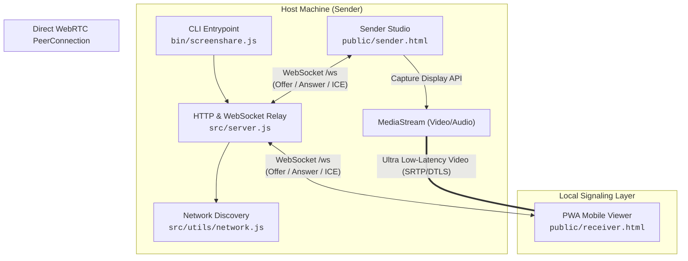

# TOTS Screen

## Zero-Config, Ultra-Low Latency Screen Sharing

**Share any screen, window, or tab across your local network (Wi-Fi/LAN) with instant QR access and mobile gesture controls.**

[](LICENSE)
[](https://bun.sh)
[](https://nodejs.org)
[](Dockerfile)
[](public/manifest.json)
[](https://webrtc.org)

---

## Overview

**TOTS Screen** is an open-source, local-first screen sharing relay engine and progressive web application built for the **TOTS Project**.

It solves a common problem: effortlessly mirroring your desktop monitor, code editor, or presentation onto an iPad, Android tablet, phone, or second computer without signups, cloud intermediaries, paid subscriptions, or clunky third-party apps. Everything streams peer-to-peer across your local Wi-Fi with sub-frame latency.

---

## Key Features

### 1. Instant Connection & Pairing

- **Zero Configuration**: Starts a local relay server and displays a high-contrast terminal and browser QR code.
- **Direct Camera Scan**: Point any phone or tablet camera at the QR code to open the viewer stream instantly.

### 2. Mobile & Tablet Touch Gestures

- **Pinch-to-Zoom**: Smooth 2-finger hardware-accelerated zoom up to 500% to inspect code and fine text.
- **Drag-to-Pan & Double-Tap Reset**: Fluid navigation with momentum and instant snap-back.
- **Immersive Fullscreen**: Hide browser address bars for a true second-monitor experience.

### 3. Multi-Stream Studio

- **Concurrent Broadcasters**: Stream multiple monitors, application windows, or browser tabs simultaneously.
- **Live Channel Selector**: Connected viewers can switch between active broadcast slots in real-time.
- **System Audio Sharing**: Stream system audio and tab sound alongside video.

### 4. 100% Private & Local

- **No Cloud Servers**: Direct WebRTC peer-to-peer data transmission over local Wi-Fi / LAN.
- **DTLS/SRTP Encryption**: End-to-end media encryption with ephemeral session keys.

---

## Architecture & Data Flow



---

## Tech Stack

| Layer                  | Technology                                                   | Purpose                                                           |
| :--------------------- | :----------------------------------------------------------- | :---------------------------------------------------------------- |
| **Runtime Engine**     | [Bun](https://bun.sh) / [Node.js](https://nodejs.org) (>=18) | Fast server execution and package management                      |
| **Signaling Protocol** | [ws](https://github.com/websockets/ws) (`^8.18.0`)           | WebSocket server for SDP exchange and stream tracking             |
| **Media Transport**    | [WebRTC](https://webrtc.org) (`RTCPeerConnection`)           | Peer-to-peer audio and video transmission                         |
| **QR Code Engine**     | [qrcode](https://github.com/soldair/node-qrcode) (`^1.5.4`)  | Terminal ASCII and dynamic `/api/qr` SVG generation               |
| **Client UI & Theme**  | Vanilla HTML5 / CSS3 / ES6                                   | Zero-dependency responsive interface with Light/Dark theme engine |
| **PWA Layer**          | Service Worker (`sw.js`) + Web Manifest                      | Offline app shell caching and native mobile installation          |
| **Containerization**   | [Docker](https://www.docker.com) + Alpine Linux              | Multi-platform containerized deployment                           |

---

## Quick Start (For Anyone / Non-Developers)

No programming knowledge required! Choose the easiest launcher for your operating system:

### Windows Users

1. Download or clone this folder.
2. Double-click **`start.bat`**.
3. It will automatically check dependencies, start the relay, and open the Hub in your browser.
4. Scan the QR code with your phone or tablet camera to start viewing!

### macOS & Linux Users

1. Open this folder in your terminal or file manager.
2. Run or double-click **`./start.sh`**:

   ```bash
   ./start.sh
   ```

3. Your browser will launch automatically. Scan the QR code to connect mobile devices.

### Instant One-Liner (No download or publishing required)

If you have Node.js or Bun installed, run directly from GitHub anywhere in your terminal:

```bash
npx github:designdotdevanshu/tots-screen --open
```

Or via NPM:

```bash
npx tots-screen --open
```

---

## Installation & Execution Methods

| Method               | Best For                  | Requirement              | Command / Action                                                 |
| :------------------- | :------------------------ | :----------------------- | :--------------------------------------------------------------- |
| **1-Click Script**   | Desktop users             | Node.js or Bun installed | Double-click `start.bat` (Windows) or `./start.sh` (macOS/Linux) |
| **NPX One-Liner**    | Quick use without cloning | Node.js                  | `npx github:designdotdevanshu/tots-screen --open`                |
| **Docker / Compose** | Home servers & NAS        | Docker                   | `docker compose up -d`                                           |
| **Global CLI**       | Power users               | Node.js / npm            | `npm i -g tots-screen` → `tots -o`                               |
| **Developer Clone**  | Contributors              | Git + Bun/Node           | `git clone ... && bun install && bun start`                      |

---

### Method 1: 1-Click Launchers (`start.sh` / `start.bat`)

Both scripts automatically detect if [Bun](https://bun.sh) or [Node.js](https://nodejs.org) is available, install required dependencies on first run, and launch your browser with the `--open` flag.

- **Windows**: Double-click `start.bat` or run:

  ```cmd
  start.bat
  ```

- **macOS / Linux**:

  ```bash
  chmod +x start.sh
  ./start.sh
  ```

---

### Method 2: Instant Run via NPX

```bash
# Run directly from GitHub repository (no install needed)
npx github:designdotdevanshu/tots-screen --open

# Run via NPM package name
npx tots-screen --open

# Run on a custom port
npx tots-screen -p 3000 --open
```

---

### Method 3: Docker & Docker Compose

#### Using Docker Compose (Recommended)

```bash
# Start container in background
docker compose up -d

# View server logs and QR code
docker compose logs -f
```

#### Using Standalone Docker

```bash
# Build Docker image
docker build -t tots-screen .

# Run container (publishing port 8080)
docker run -d --name tots-screen-hub -p 8080:8080 tots-screen
```

> **Note for Local Network Discovery in Docker**: If your mobile device cannot reach the container IP on Linux, run Docker with host network mode:
>
> ```bash
> docker run --network host tots-screen
> ```

---

### Method 4: Standard Developer Setup

```bash
# 1. Clone the repository
git clone https://github.com/designdotdevanshu/tots-screen.git
cd tots-screen

# 2. Install dependencies (using bun or npm)
bun install
# or
npm install

# 3. Start the server
bun start
# or with auto-browser launch:
bun dev
```

---

## Mobile & Tablet Viewing Guide

1. **Connect to Same Wi-Fi**: Make sure your phone/tablet is connected to the same local network as your computer.
2. **Scan the QR Code**:
   - Open your camera or QR scanner.
   - Point at the QR code shown in the terminal or browser portal (`http://<lan-ip>:8080/view`).
3. **Gesture Controls**:
   - **Pinch with 2 fingers**: Zoom in (up to 500%) to inspect small text or code.
   - **Drag with 1 finger**: Pan across the zoomed display.
   - **Double-Tap**: Reset zoom level back to fit screen.
   - **Fullscreen Button**: Hide browser address bar for maximum display area.
4. **Install as Native PWA**:
   - **iOS (Safari)**: Tap Share → select **"Add to Home Screen"**.
   - **Android (Chrome)**: Tap the 3 dots → select **"Install App"**.

---

## CLI Options & Environment Variables

```text
Usage: tots [options]
       npx tots-screen [options]

Options:
  -p, --port <port>     Port to listen on (default: 8080, or $PORT)
  -H, --host <host>     Host to bind on (default: 0.0.0.0, or $HOST)
  -o, --open            Automatically open the Hub in your browser
  --no-qr               Disable terminal ASCII QR code
  -v, --version         Display version number
  -h, --help            Show help menu
```

### Environment Variables

| Variable | Description                   | Default   | Example                    |
| :------- | :---------------------------- | :-------- | :------------------------- |
| `PORT`   | Web server and WebSocket port | `8080`    | `PORT=9000 npm start`      |
| `HOST`   | Network interface binding     | `0.0.0.0` | `HOST=127.0.0.1 npm start` |

---

## Project Directory Structure

```text
tots-screen/
├── bin/
│   └── screenshare.js         # CLI executable entrypoint (argument parser & runner)
├── src/
│   ├── server.js              # HTTP server & WebRTC signaling relay engine
│   └── utils/
│       └── network.js         # Primary LAN interface detection & browser launcher
├── public/
│   ├── index.html             # Interactive Landing Page & Web Portal (/)
│   ├── sender.html            # Desktop Sender Studio interface (/sender)
│   ├── receiver.html          # Mobile/Tablet touch-gesture Viewer (/view)
│   ├── manifest.json          # Web App Manifest for mobile installation
│   ├── sw.js                  # PWA Service Worker for caching & install prompt
│   └── icon.svg               # Vector application icon
├── start.sh                   # 1-Click launcher script for macOS & Linux
├── start.bat                  # 1-Click launcher batch file for Windows
├── Dockerfile                 # Production Bun Alpine Docker container definition
├── docker-compose.yml         # 1-command Docker Compose stack
├── .dockerignore              # Excluded files for Docker build context
├── package.json               # Package metadata, dependencies, and CLI bin mapping
├── CONTRIBUTING.md            # Contribution guidelines & coding guardrails
├── SECURITY.md                # Security policy & vulnerability reporting
├── CODE_OF_CONDUCT.md         # Contributor Covenant Code of Conduct
├── LICENSE                    # MIT License
└── README.md                  # Project documentation
```

---

## Security & Privacy

- **Local Area Network Only**: Signaling and media streams travel directly between devices on your LAN.
- **End-to-End P2P Encryption**: Video and audio data are encrypted using WebRTC DTLS/SRTP.
- **Ephemeral Session State**: Clients generate random cryptographic IDs per session with zero data persisted to disk.

---

## Contributing & Community

Contributions are welcome. Please review our [Contributing Guidelines](CONTRIBUTING.md), [Security Policy](SECURITY.md), and [Code of Conduct](CODE_OF_CONDUCT.md).

---

## License

This project is part of **The TOTS Project**, licensed under the [MIT License](LICENSE).
